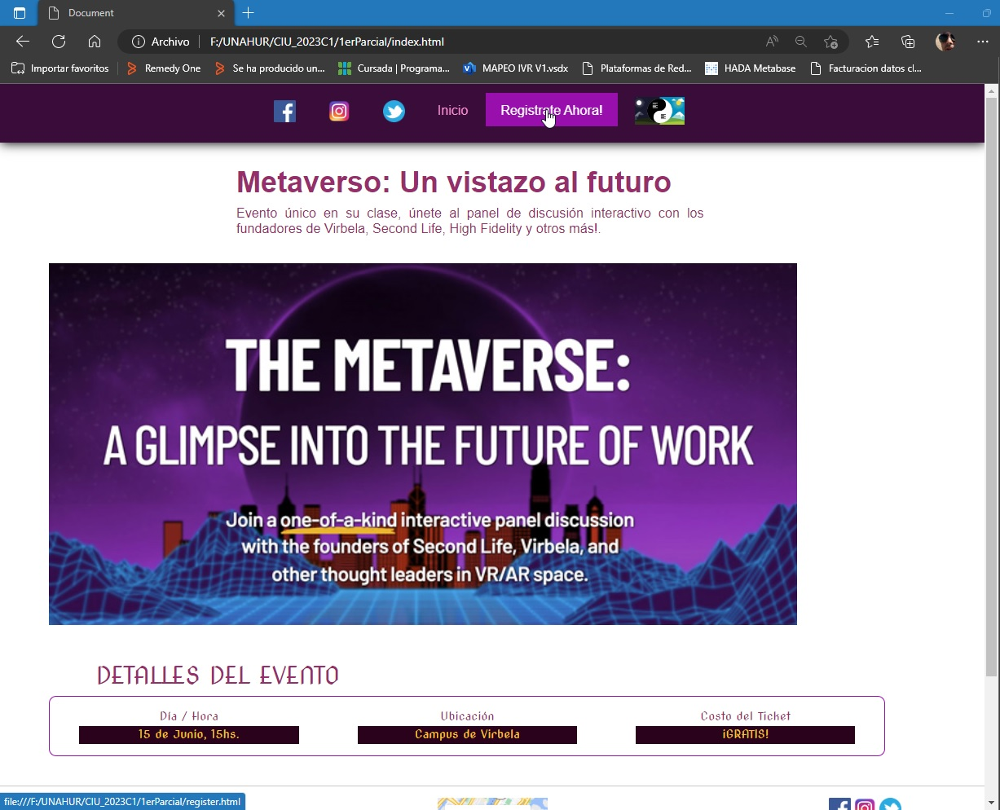
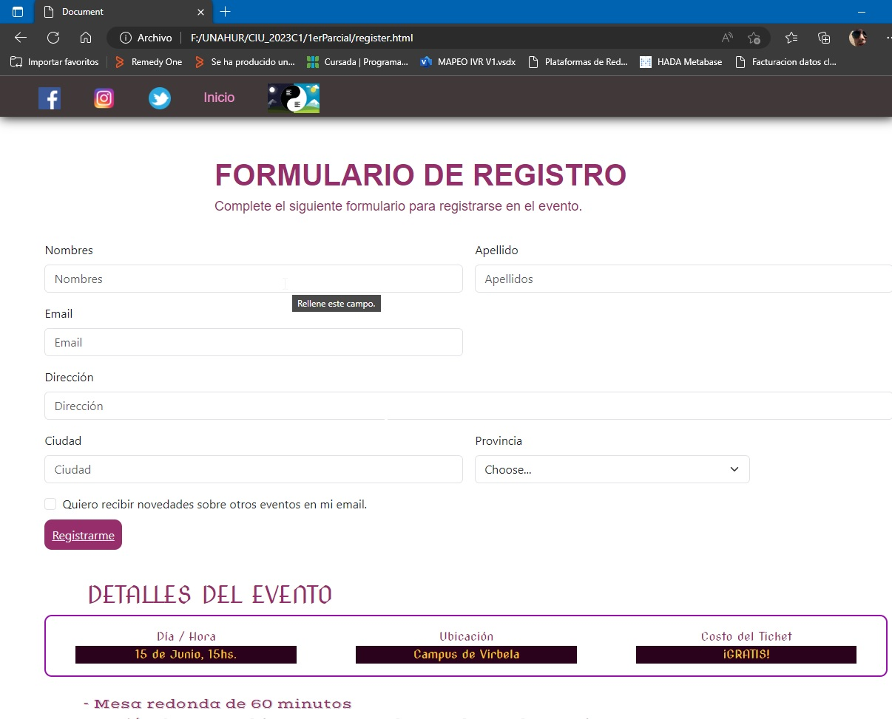

# Landing Page para 1er Parcial de CIU UNAHUR 2023C1
## Autor: Hernán Coniglio
### Comisión Jueves Noche

## Descripción
El proyecto consiste en una landing page que contiene información sobre un evento llamado "Metaverso: Un vistazo al futuro". 

El evento cuenta con un panel de discusión interactivo liderado por los fundadores de varias empresas relacionadas con el mundo virtual, como Virbela, Second Life y High Fidelity. 

La página contiene detalles del evento, como la fecha, la hora, la ubicación y el costo del ticket (que es gratis). También hay enlaces a las redes sociales de la empresa organizadora y un botón para registrarse al evento, que redirige a la página que contiene el formulario de registración. Este formulario dispone de un enlace del tipo submit para ejecutar el cliente de correo electrónico predeterminado del usuario, con el asunto y el cuerpo del mensaje predefinidos. 

Además, la página tiene una barra de navegación con enlaces a las redes sociales, la página de inicio y un botón para cambiar entre modo oscuro y modo claro. 

En el pie de página, se proporciona información de contacto del desarrollador de la página, incluyendo su nombre, dirección de correo electrónico y universidad, junto con un botón de enlace a la página principal, y un mapa de la ubicación del evento.

## Herramientas utilizadas
Para el desarrollo de la página se utilizaron las siguientes herramientas:
- HTML
- CSS
- JavaScript
- Bootstrap
- Google Fonts
- Font Awesome
- Google Maps

## Instrucciones de uso
Para utilizar la página, se debe abrir el archivo `index.html` en un navegador web.

## Link a la página
https://hernanconiglio.github.io/landing-page-ciu/

## Capturas de pantalla

